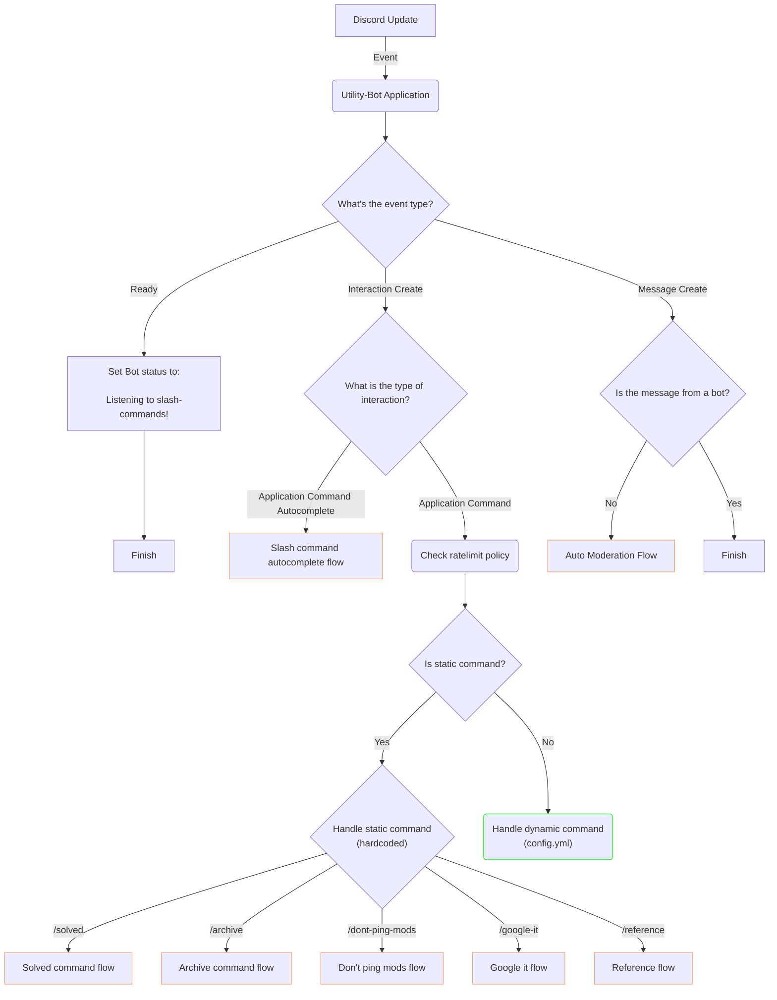

# Utility Bot

[](https://github.com/nestjs-discord/utility-bot/actions/workflows/build-and-test.yaml)
[](https://www.codefactor.io/repository/github/nestjs-discord/utility-bot/overview/main)
[](https://goreportcard.com/report/github.com/nestjs-discord/utility-bot)

A Discord bot
designed to streamline the support process on [the official NestJS Discord server](https://discord.gg/nestjs).

We've developed this bot to improve your interaction with other users.
With pre-written, perfectly formatted Markdown content delivered through slick slash commands,
you can respond to everyday situations quickly.
No more tedious explanations, no more typing out the same thing over and over again.

## Commands

| Command                        | Description                                                                    | Who can execute it?    |
|--------------------------------|--------------------------------------------------------------------------------|------------------------|
| `/solved`                      | To close and mark the forum posts as solved with a tag                         | Mods, Forum post owner |
| `/archive`                     | To close and lock the forum posts                                              | Mods                   |
| `/dont-ping-mods`              | Tell someone to stop pinging mods for help                                     | Mods                   |
| `/mods cross-post`             | Warn users not to cross-post, ask in relevant channels, and be patient         | Mods                   |
| `/mods spam`                   | A friendly warning to prevent spamming in the chat                             | Mods                   |
| `/mods elaborate`              | Please provide more context so we can better assist you with your inquiry      | Everyone               |
| `/community awesome`           | A curated list of awesome things related to NestJS (`awesome-nestjs`)          | Everyone               |
| `/community testing`           | Show off to the community methods of testing NestJS (`jmcdo29/testing-nestjs`) | Everyone               |
| `/docs behind-proxy`           | How to enable the trust proxy option behind a reverse proxy                    | Everyone               |
| `/docs circular-dependency`    | Circular dependencies in NestJS and how to avoid them                          | Everyone               |
| `/docs file-change-detected`   | How to fix when TypeScript 4.9+ on infinite loop in watch mode                 | Everyone               |
| `/docs nest-debug`             | Debug NestJS dependencies with environment variable                            | Everyone               |
| `/docs providers-vs-imports`   | Ensure accurate service/module listings                                        | Everyone               |
| `/docs request-lifecycle`      | Get a grip on NestJS' request lifecycle for smooth coding                      | Everyone               |
| `/docs resolve-dependencies`   | Nest not being able to resolve dependencies of something                       | Everyone               |
| `/rules codeblocks`            | Letting people know how to share their code in a Markdown code block           | Everyone               |
| `/rules dm`                    | Use server to get help on NestJS; don't DM other members                       | Everyone               |
| `/rules dont-ask-to-ask`       | Telling people to just ask their question with a link explaining why           | Everyone               |
| `/rules no-hello`              | Telling people not to say just 'hello' in the chat                             | Everyone               |
| `/rules reproduction`          | Request for a minimum reproduction of the issue                                | Everyone               |
| `/rules screenshot`            | When someone posts a screenshot instead of sharing their code                  | Everyone               |
| `/javascript floating-promise` | Introduction to floating Promises in JavaScript                                | Everyone               |
| `/request-info`                | Ask people to run `@nestjs/cli info` and provide the output.                   | Everyone               |
| `/show-the-error`              | Telling people to be specific when seeking help.                               | Everyone               |

## Configuration

```shell
cp .env.example .env
```

The following environment variables are required, and the rest of the configuration is located in `config.yml`.

- `DISCORD_APP_ID`
- `DISCORD_BOT_TOKEN`
- `DISCORD_GUILD_ID`

## How we handle incoming Discord updates



### Auto Moderation Flow

Placeholder.

### Solved command

Placeholder.

### Archive command

Placeholder.

### Don't ping moderators command flow

Placeholder.

### Google it command flow

Placeholder.

### Reference command flow

Placeholder.

### Slash command autocomplete flow

Placeholder.

## Docker usage

```shell
# brings down the previous container
# builds and starts a new container
# prints the container logs
make docker-redeploy
```
